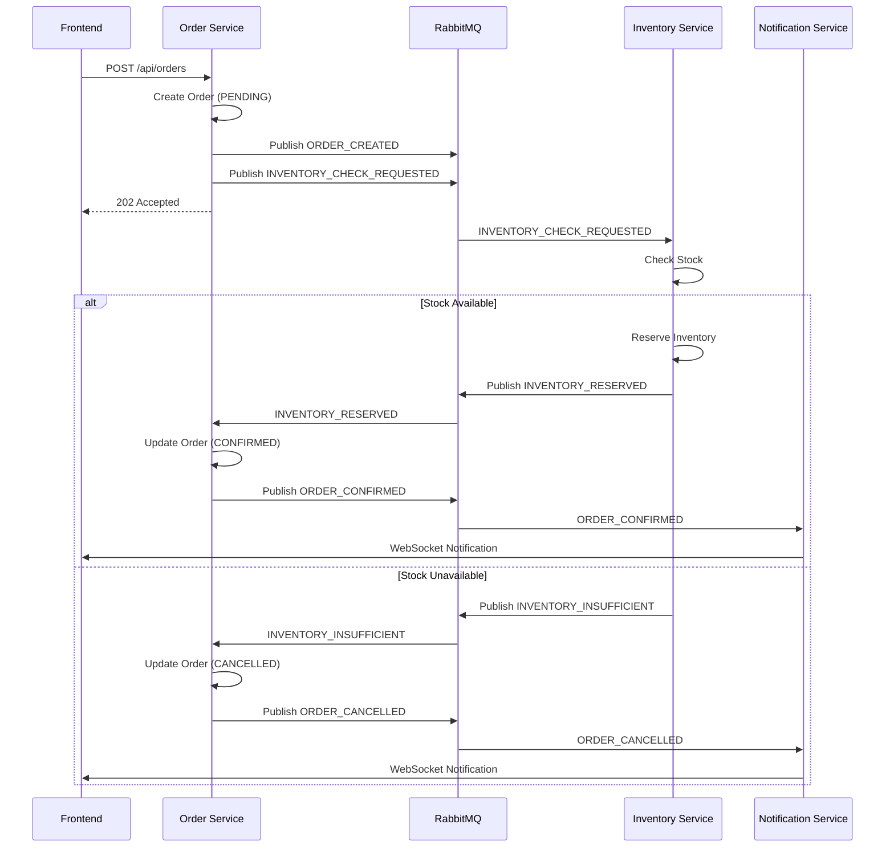

# 🚀 Event-Driven Order Management System

[](https://www.oracle.com/java/)
[](https://spring.io/projects/spring-boot)
[](https://www.mongodb.com/)
[](https://www.rabbitmq.com/) 
[](https://reactjs.org/)
[](LICENSE)

A production-ready, event-driven microservices architecture demonstrating modern enterprise patterns including **Saga Pattern**, **Event Sourcing**, **CQRS**, and **Domain-Driven Design**.

## 📋 Table of Contents

- [Overview](#overview)
- [Architecture](#architecture)
- [Features](#features)
- [Technology Stack](#technology-stack)
- [Getting Started](#getting-started)
- [Project Structure](#project-structure)
- [API Documentation](#api-documentation)
- [Service-Specific API Usage](#service-specific-api-usage)
- [Event Flow](#event-flow)
- [Design Patterns](#design-patterns)
- [Documentation](#documentation)
- [Contributing](#contributing)

## 🎯 Overview

This project demonstrates a complete event-driven microservices system for order management. It showcases:

- **Microservices Architecture**: Independent, scalable services
- **Event-Driven Communication**: Asynchronous messaging via RabbitMQ
- **Saga Pattern**: Distributed transaction management
- **Event Sourcing**: Complete audit trail of all state changes
- **CQRS**: Separation of read and write operations
- **Domain-Driven Design**: Rich domain models with business logic

### Why This Project?

Built to demonstrate enterprise-grade software engineering practices and modern architectural patterns used by companies like Netflix, Amazon, and Uber.

## 🏗️ Architecture

### System Architecture

```
┌─────────────────────────────────────────────────────────────┐
│                     Frontend (React)                         │
│                  Real-time Dashboard                         │
└──────────────────────────┬──────────────────────────────────┘
                           │ REST API + WebSocket
                           ↓
┌─────────────────────────────────────────────────────────────┐
│                    API Gateway (8080)                        │
│              Routing, Auth, Rate Limiting                    │
└──────────────────────────┬──────────────────────────────────┘
                           │
        ┌──────────────────┼──────────────────┐
        ↓                  ↓                  ↓
┌──────────────┐  ┌──────────────┐  ┌──────────────┐
│Order Service │  │Inventory Svc │  │Notification  │
│   (8081)     │  │   (8082)     │  │Svc (8083)    │
└──────┬───────┘  └──────┬───────┘  └──────┬───────┘
       │                 │                 │
       └─────────────────┼─────────────────┘
                         ↓
              ┌──────────────────┐
              │    RabbitMQ      │
              │  Message Broker  │
              │  (Event Mesh)    │
              └──────────────────┘
                         ↓
        ┌────────────────┼────────────────┐
        ↓                ↓                ↓
┌──────────────┐  ┌──────────────┐  ┌──────────────┐
│  MongoDB     │  │  MongoDB     │  │  MongoDB     │
│  order-db    │  │inventory-db  │  │notification  │
└──────────────┘  └──────────────┘  └──────────────┘
```

### Event Flow (Saga Pattern)



## ✨ Features

### Core Features

- ✅ **Order Management**: Create, read, update, delete orders
- ✅ **Inventory Management**: Real-time stock tracking and reservation
- ✅ **Event-Driven Communication**: Asynchronous messaging between services
- ✅ **Real-time Notifications**: WebSocket-based live updates
- ✅ **Distributed Transactions**: Saga pattern implementation
- ✅ **Event Sourcing**: Complete audit trail
- ✅ **API Gateway**: Centralized routing and security

### Technical Features

- 🔐 **Security**: JWT authentication, CORS configuration
- 📊 **Monitoring**: Spring Boot Actuator, health checks
- 🐳 **Containerization**: Docker and Docker Compose
- 🧪 **Testing**: Unit tests, integration tests, test containers
- 📝 **Documentation**: OpenAPI/Swagger, comprehensive guides
- 🔄 **CI/CD Ready**: GitHub Actions workflows
- 📈 **Scalability**: Horizontal scaling with consumer groups
- 🛡️ **Resilience**: Retry logic, circuit breakers, DLQ

## 🛠️ Technology Stack

### Backend

| Technology | Version | Purpose |
|------------|---------|---------|
| Java | 17 | Programming Language |
| Spring Boot | 3.2.0 | Application Framework |
| Spring Cloud Stream | 4.1.0 | Event-Driven Messaging |
| Spring Data MongoDB | 3.2.0 | Database Access |
| RabbitMQ | 3.12 | Message Broker |
| MongoDB | 7.0 | NoSQL Database |
| Lombok | 1.18.30 | Boilerplate Reduction |
| JUnit 5 | 5.10.0 | Testing Framework |

### Frontend

| Technology | Version | Purpose |
|------------|---------|---------|
| React | 18 | UI Framework |
| TypeScript | 5.0 | Type Safety |
| Vite | 5.0 | Build Tool |
| TanStack Query | 5.0 | Data Fetching |
| Tailwind CSS | 3.4 | Styling |
| WebSocket | - | Real-time Updates |

### DevOps

| Technology | Purpose |
|------------|---------|
| Docker | Containerization |
| Docker Compose | Multi-container Orchestration |
| Maven | Build Tool |
| GitHub Actions | CI/CD |

## 🚀 Getting Started

### Prerequisites

- **Java 17** or higher
- **Maven 3.8+**
- **Docker & Docker Compose**
- **Node.js 18+** (for frontend)
- **Git**

### Quick Start (Docker Compose)

1. **Clone the repository**
   ```bash
   git clone https://github.com/yourusername/order-management-system.git
   cd order-management-system
   ```

2. **Start all services**
   ```bash
   docker-compose up -d
   ```

3. **Access the application**
   - Frontend: http://localhost:3000
   - Order Service: http://localhost:8081
   - Inventory Service: http://localhost:8082
   - RabbitMQ Management: http://localhost:15672 (guest/guest)
   - Mongo Express (MongoDB GUI): http://localhost:8888 (admin/admin123)

### Manual Setup (Development)

#### 1. Start Infrastructure

```bash
# Start MongoDB
docker run -d -p 27017:27017 --name mongodb mongo:7.0

# Start RabbitMQ
docker run -d -p 5672:5672 -p 15672:15672 --name rabbitmq rabbitmq:3.12-management
```

#### 2. Build and Run Backend

```bash
cd backend
cd order-service
mvn spring-boot:run
mvn spring-boot:run
```

#### 3. Run Frontend

```bash
cd frontend
npm install
npm run dev
```

## 📁 Project Structure

```
order-management-system/
├── backend/
│   ├── common/                      # Shared DTOs, Events, Utilities
│   │   └── src/main/java/com/eventdriven/oms/common/
│   │       ├── dto/                 # Data Transfer Objects
│   │       ├── event/               # Event definitions
│   │       └── enums/               # Enums (OrderStatus, etc.)
│   │
│   ├── order-service/               # Order Management Service
│   │   └── src/main/java/com/eventdriven/oms/orderservice/
│   │       ├── controller/          # REST Controllers
│   │       ├── service/             # Business Logic
│   │       ├── repository/          # Data Access
│   │       ├── model/               # Domain Entities
│   │       ├── event/               # Event Publishers/Listeners
│   │       └── config/              # Configuration
│   │
│   ├── inventory-service/           # Inventory Management Service
│   │   └── src/main/java/com/eventdriven/oms/inventoryservice/
│   │       ├── service/
│   │       ├── repository/
│   │       ├── model/
│   │       └── event/
│   │
│   ├── notification-service/        # Notification Service
│   │   └── src/main/java/com/eventdriven/oms/notificationservice/
│   │       ├── websocket/           # WebSocket Configuration
│   │       └── event/
│   │
│   └── api-gateway/                 # API Gateway
│       └── src/main/java/com/eventdriven/oms/gateway/
│
├── frontend/                        # React Frontend
│   ├── src/
│   │   ├── components/              # React Components
│   │   ├── services/                # API Services
│   │   ├── hooks/                   # Custom Hooks
│   │   └── pages/                   # Page Components
│   └── package.json
│
├── docs/                            # Documentation
│   ├── SPRINGBOOT_CONCEPTS.md       # SpringBoot Learning Guide
│   ├── INTERVIEW_WALKTHROUGH.md     # Interview Preparation
│   └── API_DOCUMENTATION.md         # API Reference
│
├── docker-compose.yml               # Docker Compose Configuration
├── .gitignore
└── README.md
```

## 📚 API Documentation

### Order Service API

#### Create Order
```http
POST /api/orders
Content-Type: application/json

{
  "customerId": "CUST123",
  "customerName": "John Doe",
  "items": [
    {
      "productId": "PROD001",
      "productName": "Laptop",
      "quantity": 1,
      "price": 999.99
    }
  ],
  "shippingAddress": "123 Main St"
}

Response: 202 Accepted
{
  "orderId": "abc-123",
  "status": "PENDING",
  "totalAmount": 999.99,
  "createdAt": "2024-01-15T10:30:00"
}
```

#### Get Order by ID
```http
GET /api/orders/{orderId}

Response: 200 OK
{
  "orderId": "abc-123",
  "customerId": "CUST123",
  "status": "CONFIRMED",
  "items": [...],
  "totalAmount": 999.99
}
```

#### Get Orders by Customer
```http
GET /api/orders/customer/{customerId}

Response: 200 OK
[
  {
    "orderId": "abc-123",
    "status": "CONFIRMED",
    ...
  }
]
```

### Service-Specific API Usage

#### Order Service ([http://localhost:8081](http://localhost:8081))

- **Get all orders**
  ```http
  GET /api/orders
  ```
- **Get order by ID**
  ```http
  GET /api/orders/{orderId}
  ```
- **Create order**
  ```http
  POST /api/orders
  Content-Type: application/json
  {
    "customerId": "CUST123",
    "customerName": "John Doe",
    "items": [
      { "productId": "PROD001", "productName": "Laptop", "quantity": 1, "price": 999.99 }
    ],
    "shippingAddress": "123 Main St"
  }
  ```
- **Get orders by customer**
  ```http
  GET /api/orders/customer/{customerId}
  ```

#### Inventory Service ([http://localhost:8082](http://localhost:8082))

- **Health check**
  ```http
  GET /actuator/health
  ```
- _Note: Inventory API endpoints (e.g., `/api/inventory`) are not yet implemented and will return 404._

### Full API Documentation

For complete API documentation, visit:
- Swagger UI: http://localhost:8081/swagger-ui.html
- OpenAPI Spec: http://localhost:8081/v3/api-docs

## 🔄 Event Flow

### Event Types

| Event | Publisher | Subscribers | Purpose |
|-------|-----------|-------------|---------|
| `ORDER_CREATED` | Order Service | Analytics, Notification | Order created audit |
| `INVENTORY_CHECK_REQUESTED` | Order Service | Inventory Service | Request stock check |
| `INVENTORY_RESERVED` | Inventory Service | Order Service | Stock reserved |
| `INVENTORY_INSUFFICIENT` | Inventory Service | Order Service | Insufficient stock |
| `ORDER_CONFIRMED` | Order Service | Notification, Analytics | Order confirmed |
| `ORDER_CANCELLED` | Order Service | Inventory, Notification | Order cancelled |
| `INVENTORY_RELEASED` | Inventory Service | Analytics | Stock released |

### Event Structure

```json
{
  "eventId": "uuid",
  "eventType": "ORDER_CREATED",
  "order": { ... },
  "timestamp": "2024-01-15T10:30:00",
  "source": "order-service",
  "correlationId": "abc-123",
  "message": "Optional message"
}
```

## 🎨 Design Patterns

### Implemented Patterns

1. **Saga Pattern**: Distributed transaction management
2. **Event Sourcing**: Audit trail and state reconstruction
3. **CQRS**: Separate read and write models
4. **Repository Pattern**: Data access abstraction
5. **Factory Pattern**: Event creation
6. **Builder Pattern**: Object construction (Lombok)
7. **Dependency Injection**: Loose coupling
8. **Circuit Breaker**: Fault tolerance (Resilience4j)

### Architectural Patterns

- **Microservices Architecture**
- **Event-Driven Architecture**
- **Layered Architecture** (Controller → Service → Repository)
- **Database per Service**
- **API Gateway Pattern**

## 📖 Documentation

### Learning Resources

- **[SpringBoot Concepts Guide](docs/SPRINGBOOT_CONCEPTS.md)**: Complete SpringBoot reference
- **[Interview Walkthrough](docs/INTERVIEW_WALKTHROUGH.md)**: How to present this project
- **[API Documentation](docs/API_DOCUMENTATION.md)**: Detailed API reference

### Key Concepts Explained

- **Dependency Injection & IoC**: How Spring manages beans
- **Event-Driven Architecture**: Asynchronous communication
- **Saga Pattern**: Distributed transactions
- **Spring Cloud Stream**: Message broker abstraction
- **MongoDB with Spring Data**: NoSQL database access
- **REST API Best Practices**: HTTP methods, status codes

## 🧪 Testing

### Run Tests

```bash
# Run all tests
mvn test

# Run tests for specific service
cd backend/order-service
mvn test

# Run with coverage
mvn test jacoco:report
```

### Test Structure

- **Unit Tests**: Service and repository layer tests
- **Integration Tests**: Full application context tests
- **Test Containers**: Real MongoDB and RabbitMQ in Docker

## 🔧 Configuration

### Environment Variables

```bash
# MongoDB
MONGODB_URI=mongodb://localhost:27017/order-db

# RabbitMQ
RABBITMQ_HOST=localhost
RABBITMQ_PORT=5672
RABBITMQ_USER=guest
RABBITMQ_PASSWORD=guest

# Application
SERVER_PORT=8081
SPRING_PROFILES_ACTIVE=dev
```

### Profiles

- **dev**: Development environment (local MongoDB, verbose logging)
- **prod**: Production environment (external MongoDB, minimal logging)
- **test**: Testing environment (in-memory databases)

## 🚀 Deployment

### Docker Deployment

```bash
# Build images
docker-compose build

# Start services
docker-compose up -d

# View logs
docker-compose logs -f

# Stop services
docker-compose down
```

### Kubernetes Deployment

```bash
# Apply configurations
kubectl apply -f k8s/

# Check status
kubectl get pods
kubectl get services
```

## 📊 Monitoring

### Health Checks

- Order Service: http://localhost:8081/actuator/health
- Inventory Service: http://localhost:8082/actuator/health
- RabbitMQ: http://localhost:15672
- MongoDB GUI (Mongo Express): http://localhost:8888 (admin/admin123)

### Metrics

- Prometheus: http://localhost:8081/actuator/prometheus
- Metrics: http://localhost:8081/actuator/metrics

## 🤝 Contributing

Contributions are welcome! Please follow these steps:

1. Fork the repository
2. Create a feature branch (`git checkout -b feature/amazing-feature`)
3. Commit your changes (`git commit -m 'Add amazing feature'`)
4. Push to the branch (`git push origin feature/amazing-feature`)
5. Open a Pull Request

## 📝 License

This project is licensed under the MIT License - see the [LICENSE](LICENSE) file for details.

## 👤 Author

**Your Name**
- GitHub: [@yourusername](https://github.com/yourusername)
- LinkedIn: [Your LinkedIn](https://linkedin.com/in/yourprofile)
- Email: your.email@example.com

## 🙏 Acknowledgments

- Spring Boot Team for the excellent framework
- RabbitMQ Team for the reliable message broker
- MongoDB Team for the flexible database
- The open-source community

## 📞 Support

For questions or support:
- Open an issue on GitHub
- Email: your.email@example.com
- LinkedIn: [Your Profile](https://linkedin.com/in/yourprofile)

---

⭐ **Star this repository if you find it helpful!**

Built with ❤️ using SpringBoot, React, and Event-Driven Architecture